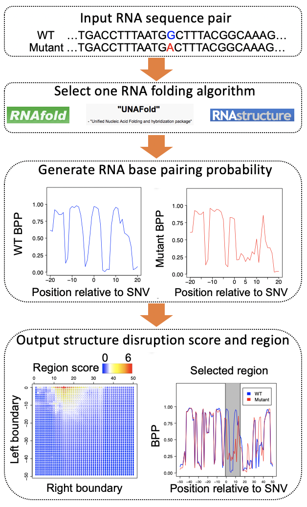

# Riprap
Riprap Predict RNA structural disruptions induced by single nucleotide variants 

We introduce a novel computational framework–RIboSNitch Predictor based on Robust Analysis of Pairing probabilities (Riprap). Riprap identifies structurally disrupted regions induced by any given SNVs based on robust analysis of local structural configurations between wild-type and mutant RNA sequences.

## [Instructions](Instructions.md)
1. Prerequisites
2. Run Riprap

## [Downloads](Downloads.md)
1. Source code
2. Sample data

## [Examples](Examples.md)
1. Sample input
2. Command example
3. Sample output

## Reference
[Lin, J., Zhang, Y., Chen, Y., & Ouyang, Z. (20xx). Predicting, annotating, and visualizing RNA structural disruptions induced by single nucleotide variants using Riprap]()

## License
Use of PRAS is free for academic users under the GNU General Public License (GPL). Commercial users please contact the authors.

## Contact
Zhengqing Ouyang: ouyang@schoolph.umass.edu
Jianan Lin: jianan.lin@jax.org

